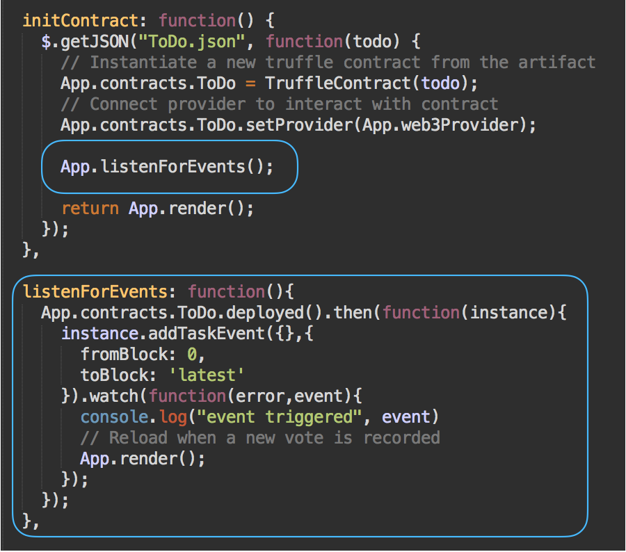

# Dapp, Truffle: To Do 

- Links:
	- [How to Build Ethereum Dapp (Decentralized Application Development Tutorial), Dapp University, YouTube](https://www.youtube.com/watch?v=3681ZYbDSSk)
	- [Step by Step Guide to Build a Dapp, Moses Sam Paul, Medium](https://medium.com/heptagon/step-by-step-guide-to-build-a-dapp-a-homo-sapiens-2-day-love-affair-with-ethereum-dapp-de2b0dea12f1)

- Tools:
	- Truffle: framework to create dapps on the ethereum network
	- Web3 JS: enables client side app to talk to the blockchain 
	- Metamask: enables browser to talk to the blockchain 
	- Ganache: local development blockchain 

- Steps:
	- Part 1: Environment + Smoke Test
	- Part 2: Add and List Tasks
	- Part 3: Add Events 

## Part 1: Environment + Smoke Test
- Environment Setup: Install Truffle (npm install -g truffle), start Ganache 
- Create a Truffle project using a Truffle box
	- Make project folder: mkdir todo, cd todo
	- Unbox pet-shop truffle package: truffle unbox pet-shop 
- Write a smart contract to test that everything is setup correctly 
	- Create a ToDo.sol file in the contracts folder
		- Declare the version of solidity: pragma solidity ^0.4.2;
		- Declare the contract 
		- Create the constructor (has the same name as the contract. It only gets called once when the contract is created.). Store the value of a task inside the constructor (a variable without an underscore is a state variable. It’s something that’s accessible inside of the contract) 
		- Declare a state variable public (which by default generates a corresponding getter method instead of having to define it ourselves) to store and read task

```solidity
pragma solidity ^0.4.2;

contract ToDo {
	// Store task
	// Read task
	string public task;

	// Constructor
	function ToDo() public {
		task = "Task 1";
	}
}
```
- Deploy/migrate the smart contract to a local blockchain 
	- Create '2_deploy_contracts.js' and put it in the migrations folder
	- Migrate: truffle migrate (this will reduce the ether in the first node in the local blockchain, Ganache)
- Check if the deployment worked and responds to everything we expect it to by interacting with the smart contract
	- Open the truffle console: truffle console
	- Get an instance of the smart contract: ToDo.deployed().then(function(instance) { app = instance }) 
	- Get the task variable defined in the contructor: app.task() (note: it’s a function not a variable because we got a getter function for free from solidity by declaring the state variable task public e.g. string public task)

## Part 2: Add and List Tasks
- Contract 
	- Restructure the smart contract to allow for adding multiple task, along with retrieving the data associated with it based on their id as a key 
	- Model a task by creating a struct, which will store the id, name and category of a task
	- Store multiple tasks and fetch task: create the mapping (a hash table, which consists of key and value type pairs). This mapping accepts a key type of id and the value type will be the struct created above. It will be referred to as tasks
	- Store tasks count
	- Add task (_name is a local variable that’s why there’s an underscore. It’s public so that it can be accessible to the public interface of the contract.  Tasks will be stored in the mapping with the key, uint and the value will be the Task struct.) 
	- Call the addTask function inside the constructor. This will run every time the contract is migrated/deployed to the blockchain
- Migrate
	- truffle migrate --reset
- Test it out in the console
	- truffle console 
	- Get a deployed instance of the contract and assign it to a variable: ToDo.deployed().then(function(i){app =i; })
	- Add a new task: app.addTask(“<Task>”, “<Status>”)
	- View the first task in the list: app.tasks(1)
	- Inspect the values of task 1:
		- app.tasks(1).then(function(t) {task = t; })
		- To retrieve the id (access it using zero based index): task[0]
		- To retrieve the name: task[1]
		- To convert the id to a number: task[0].toNumber()
- Write test 
	- Reasons to test (ensure it’s bug free) before deploying contract to the blockchain
		- Everything written to the blockchain is immutable
		- It costs Ether/Gas to write to the contract
	- Write test in JS to simulate client-side interactions with the contract 
	- Tools: Framework (Mocha), Assertion Lib (Chai)
	- Create a test file, todo.js in the test folder to run the test: mkdir test/todo.js
	- Write code to test to see if there are correct no. of tasks (2 in this case), the tasks have the correct values, and that it's possible to add a task 
	- Ensure all 3 test pass: truffle test

```javascript
var ToDo = artifacts.require("./ToDo.sol");

contract("ToDo", function(accounts){
	var todoInstance;

	it("initializes with two tasks", function(){
		return ToDo.deployed().then(function(instance){
			return instance.tasksCount();
		}).then(function(count){
			assert.equal(count,2);
		});
	});

	it("initializes the tasks with the correct values", function(){
		return ToDo.deployed().then(function(instance){
			todoInstance = instance;
			return todoInstance.tasks(1);
		}).then(function(task){
			assert.equal(task[0], 1, "contains the correct id");
			assert.equal(task[1], "Task 1", "contains the correct name");
			assert.equal(task[2], "Work", "contains the correct category");
			return todoInstance.tasks(2);
		}).then(function(task){
			assert.equal(task[0], 2, "contains the correct id");
			assert.equal(task[1], "Task 2", "contains the correct name");
			assert.equal(task[2], "Personal", "contains the correct category");
		});
	});

	it("can add a task", function(){
		return ToDo.deployed().then(function(instance){
			todoInstance = instance;
			return todoInstance.addTask("Task 3", "Personal")
		}).then(function(receipt){
			return todoInstance.tasksCount();
		}).then(function(count){
			assert.equal(count,3);
		});
	});
});
```
- Write the client-side application--create a user interface to interact with the smart contract
	- Write the front end code—HTML & JS (index.html & app.js) 
		- app.js (steps: initialise the app (init), initialise web3, which initialises the contract, and once the contract is initialised it’ll render out the content of the app on the page). Note: The $.getJSON function works for this ToDo.json file because we’re using the browser sync package (bs-config.json) that came with the truffle box and the browser sync package is configured to read JSON files out of the build contracts directory) 
	- Migrate the contract: truffle migrate --reset
	- Start the lite server (Package.json has the liteserver): npm run dev 
	- Use metamask to connect to the local blockchain 
	- Set up MetaMask with your Ganache chain
		- Connect metamask to the blockchain created by Ganache: click on the menu that shows ‘Main Network’, select Custom RPC. Enter the following url into the “New RPC URL” box : http://localhost:7545 (you can see the port number from the Ganache blockchain) and click Save. The network at the top will now say “Private Network”. (Each account created by Ganache is given 100 ether. The first account should have less than the others because that account supplies the gas for smart contract deployment.)
		- Click on restore seed phase, enter the Ganache seed phase (get it from ganache)

## Part 3: Add Events
- Add event to contract
	- Add addTaskEvent
	- Add the event to the addTask function—triggers the event whenever a task is added

```solidity
event addTaskEvent(
	uint indexed _taskId
);
```

- Migrate
- Write test for the event
	- Ensure that the event gets triggered 


- Update client-side app to listen for the event
	- Add listenForEvents to app.js



- Migrate
- Restart Chrome
- Start the lite server: npm run dev 


 


